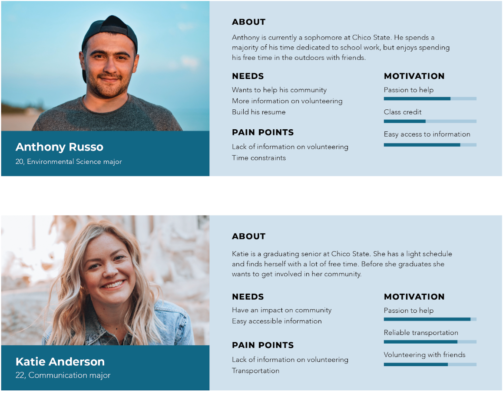

# Volunteer Team, Phase 1: User Inquiry and Inspection

## Executive Summary

* Our research included the participation of 14 users.
* Passion for helping in the community and resume building were popular responses for motivation behind volunteering.
* 62% of participants do not volunteer as often due to time constraints.
* Research found that volunteering makes participants feel better about themselves knowing they are taking time to help others.
* Users want their volunteer experience to be improved by more organization, easy access to volunteer opportunities, and rewards for their service.
* 92% of participants have volunteered before, but only 76% intend to volunteer again.
* 76% of participants would volunteer more often if there was an easier way to find opportunities.
* 23% of participants are prevented from volunteering due to transportation.
* Research found that receiving class credit is a large motivator for students to volunteer.
* 12/13 participants are more likely to volunteer if they can do so with a friend.
Data from the survey shows students are more likely to volunteer after a natural disaster rather than on a holiday or special event. 

## Methods

Our goal in gathering data was to find some answers that would help us design a volunteer platform. We wanted to see what motivates and incentives people to volunteer as well as what prevents or hardships individuals go through to volunteer. We also wanted some qualitative data that ranged from 1(least) to 5(most) which would give us a better understanding of what we would need to prioritize. Our best bet was to go with a survey that would ask various questions to see what motivates or struggles volunteers might go through. 

## Findings

As of April 6, we have 14 responses on our surveys. This may not be enough, but we could clearly see a trend after gathering this information. It seems like generally people do like to volunteer because it helps the community and makes them feel good. It also seems like time is a big constraint for most people. Another important note is that people want to find a better solution to finding volunteer opportunities. 

We’ll go over a few of our questions with more detail that gave us the most insight. 
1. What motivates you to volunteer? (free response)
  * We learned that people want to help out the community or to either gain something whether its personal satisfaction or something they could say they did.
2. What prevents you from volunteering? (free response)
  * The most common replies were time, doing it alone, and no recognition. This is definitely something we want to work on. We can’t do anything about people’s time, but we can surely help people to find a buddy to volunteer with or gain some kind of recognition by providing a certificate or something. 
3. How could volunteer experience be improved? (free response)
  * All the answers were vast, but this might be a good sign. There are just so many issues that people go through to find volunteering opportunities that our best goal would be to make the process as simple as possible. 
4. Does class credit motivate you to volunteer? 
  * We got only a 7% for ‘No’. Since we didn’t record any demographic data, we might assume that our users are students ranging from highschool to college students. This could indicate that we could transition to a student focused volunteering platform instead. 
5. Are you likely to volunteer with a friend? 
  * We received 100% of ‘Yes’s. Sample size was small, but its pretty evident that people want to volunteer with friends. A co-op/pair volunteering feature would be an idea to think about. 

## Conclusions

Discoveries derived from the method(s). For example, explain a requirement (e.g. “Task X needs to be accomplished with fewer steps. . . ”) based on a finding (e.g. “. . . because in our contextual inquiry, we found it was what the users did most often and complained about extraneous work needed to complete it”)

## Caveats

One of the caveats of using a survey to gather data is that we are not collecting contact information so we can not follow up with respondents. Another caveat is that we have only shared our survey to the class so we are not getting a very diverse crowd because we are not allowed to do human studies due to the Coronavirus pandemic.

## Personas 

These personas were derived from our data. We highlighted key factors such as time constraints, desire to help the community, easy access to volunteer opportunities, and class credit to help build and shape our idea of a potential user of our system. Since our data did not show whether the participants were male or female, nor their age, we found it best fit to use both genders and give them ages relevant to college students.  Each category of the persona reflects the data that was shown in our research.

## Scenarios

As mentioned above, Anthony has a busy schedule with a primary focus on school. He does have the desire to help in his community, but can never seem to find the time to look into volunteer opportunities. Our system would best be utilized in this scenario as Anthony can easily sign up to get connected to local volunteer services in his community. After signing up, our system would take Anthony through a quick questionnaire so he could create a profile. A profile would include information such as location as well as his talents, skills, and interest. All of this information would be displayed on his profile page and will be further utilized to help match Anthony to local volunteer opportunities. Having a system such as our set in place, helps individuals save on time as they are becoming more efficient in their search.

Katie has a fairly open schedule for her senior year and does not face time constraints like most users. However, Katie does not have a car and is in need of reliable transportation to get her to and from when volunteering. She also has no idea where to begin looking to volunteer. Luckily, our system can help match Katie to local opportunities. Similarly to Anthony, after signing up and creating a profile, Katie can be matched to volunteer opportunities in the area. Since Katie faces issues with transportation, our system also provides a connection to uber/lyft that Katie can schedule (free of cost) to help her get to her desired location safely.

## Supplementary Materials

We are distributing a survey built in google forms. Responses automatically get put in a spreadsheet. This can be found at [here](https://forms.gle/FvFKK7UVtfbz9bZR7)

## Conclusion

We were able to gather enough information from our classmates to start designing our platform. We have customer personas and a good idea of how uers might use the service. Unfortunatly we were unable to get information from real potential customers but this will do.

