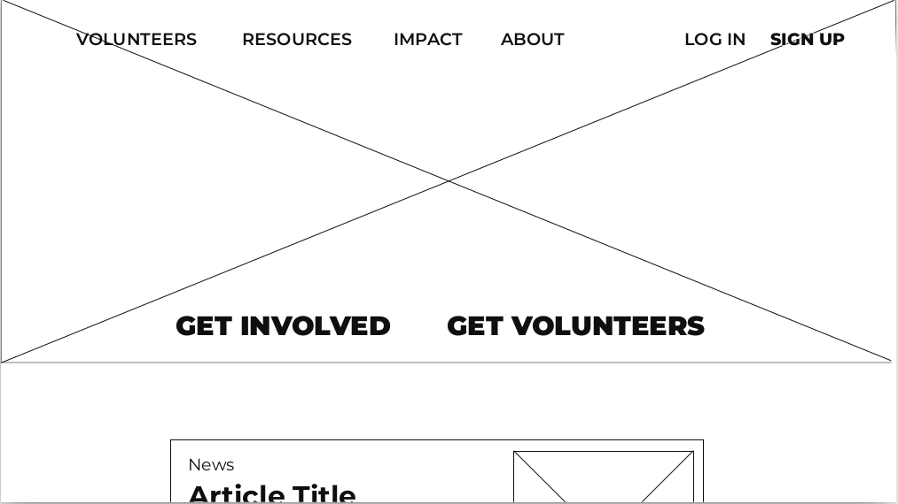
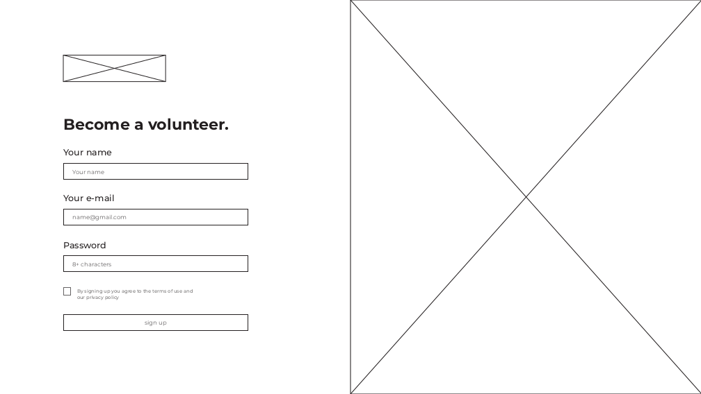
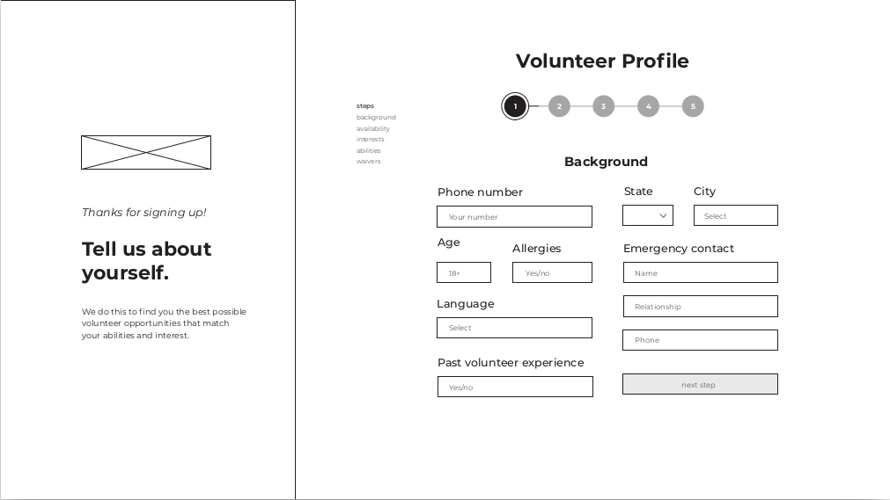
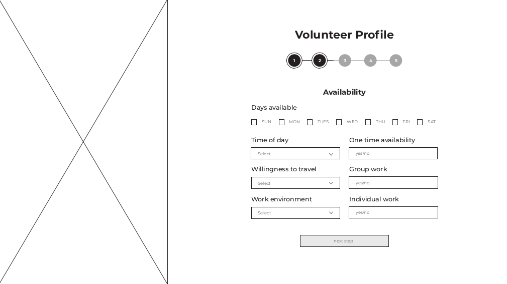
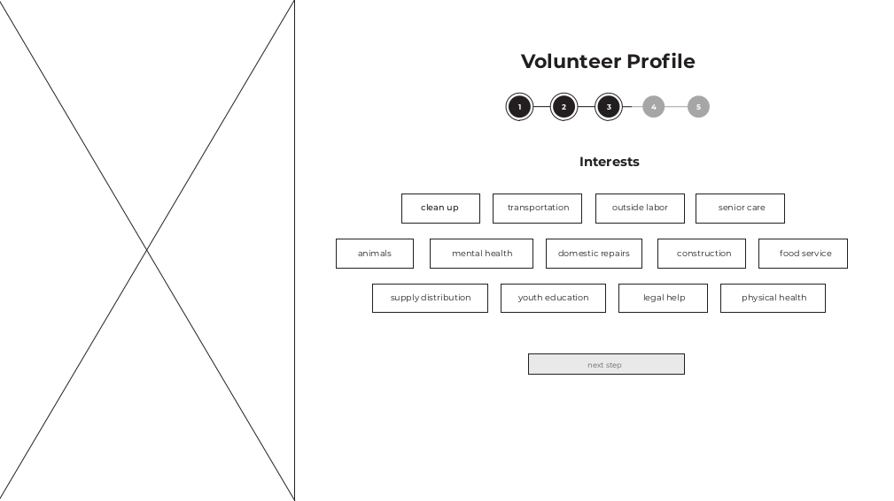
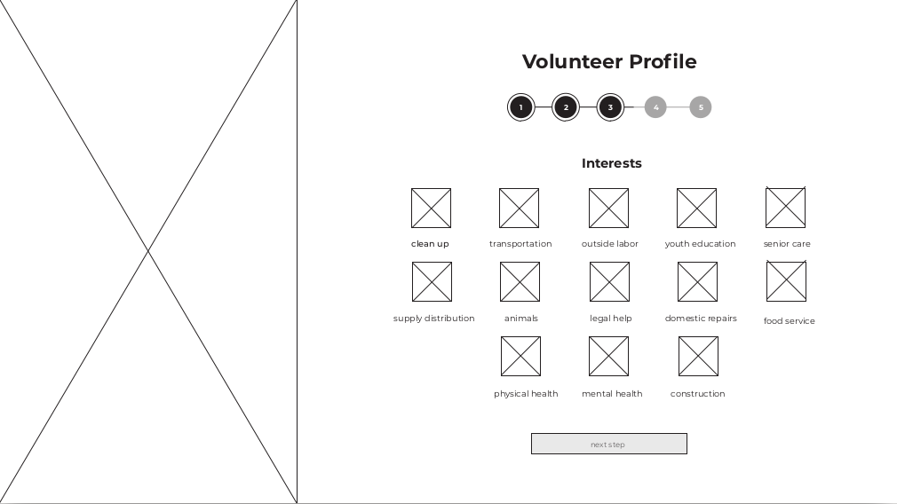
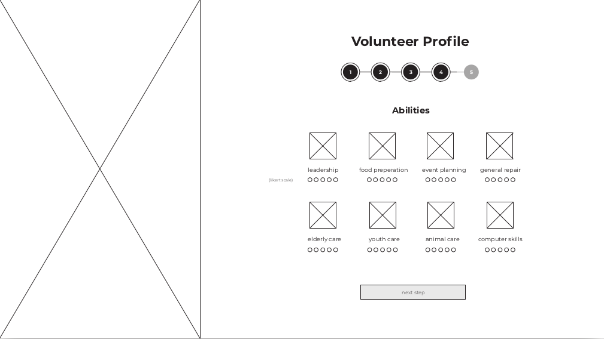
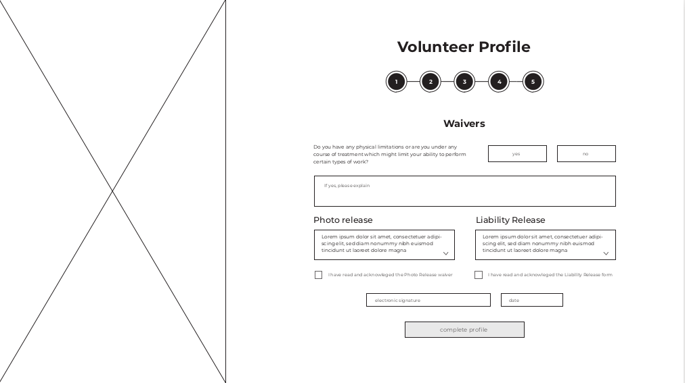
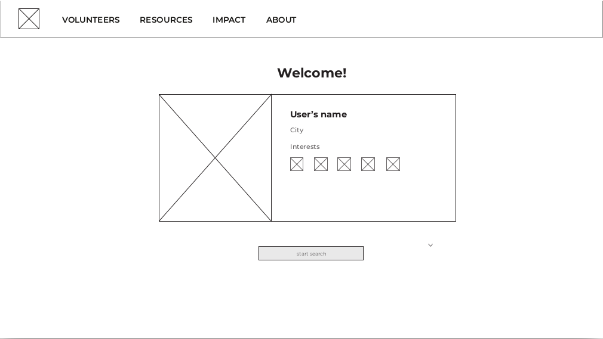
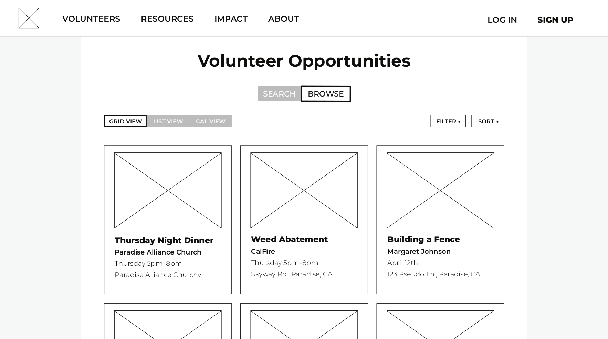

## Phase 2: User-Centered Design
Jonathan Cheon, Haley Martin, Albert Swingler

This is our homepage where. We wanted to grab the users attention by centering our action calls at the center of the screen. The two options are "GET INVOLVED" and "GET VOLUNTEERS". This phase will focus on the "GET INVOLVED" portion since that is where most users will go to. 

Once users click, "GET INVOLVED", they will be shown a new screen where they will be able to get started on our onboarding process. This screen is where they will be able to sign up for an account by providing their name, email, and password. 

Instead of asking for the user for a bunch of information at a time, they will be able to provide their information in bits so they don't lose focus. There is a progress bar on the top of the screen where they will be able to see how far ahead they are in their process. If at any time they want to go back, they can click on the progress bad to edit their information. Anyways, in this section, users will be able to provide us with their background information such as phone number, demographics, location, and past volunteering experience. We added this because we noticed that over 60% of the participants had previous volunteering experience. This is a great way for us to connect orginzations that need more experienced volunteers instead of new volunteers. Lastly, more than 70% of our survey participants indicated that they would more likely volunteer with a friend. We added that option to indicate that we would try to match them with their friends or other people they could potentially volunteer with. 

After they click next, they will be presented with this screen where users could input their availabilities. According to our survey, time contraint was a huge factor where users felt they did not have enough time in their day to volunteer. By providing an availability form, we can not only help organizations find a availability fit for their needs, but also provide kind of a mental contract for the users. This way the users will consciously be aware that they have provided their availabilities and will push them to actually be available for their volunteering service if they were accepted. 

In this screen, users would be able to share their interests with us. Since there are various types of organizations people could volunteer for, users can share their interests where we could match them with volunteering experiences they would enjoy. We labled some popular volunteering categories for users. 

